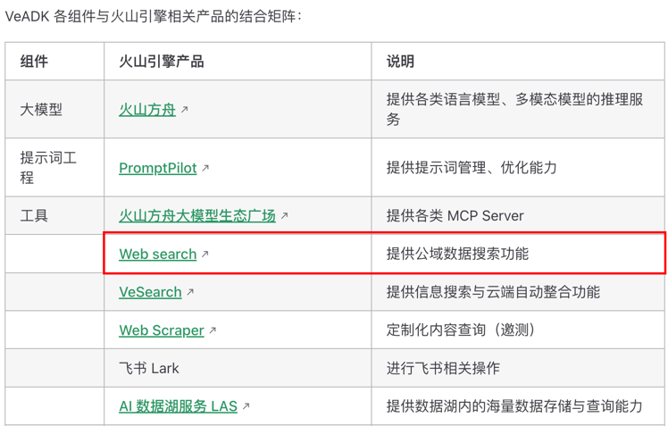
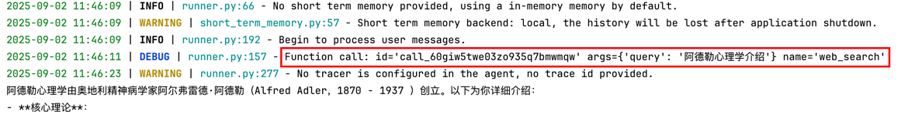
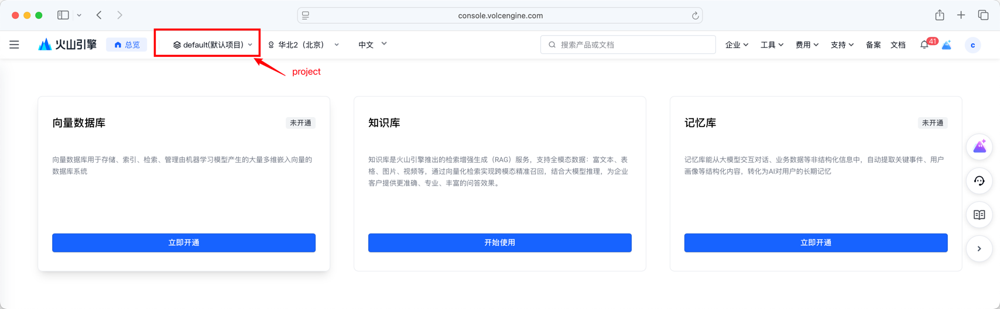
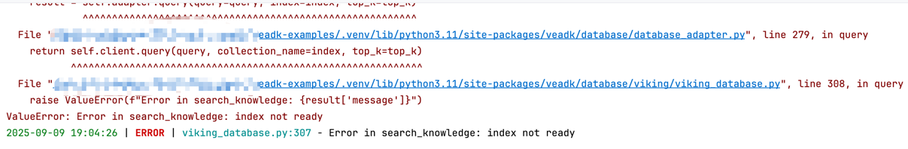
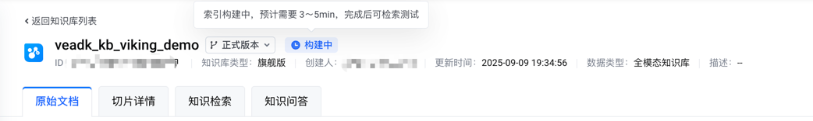

# Basic-Usage

这部分介绍的是最基础的用法，包括工具调用，长期记忆、短期记忆以及流失输出等基础使用方式，不会涉及到更复杂的部分。包括单/多个Agent的运行，带工具(mcp)、多轮对话，流式输出，多模态、长期记忆和知识库等等，如果你仅仅是想要娱乐的方式来“玩”Agent，那么这些就足够了。

> 注1:可用版本指的是**该example在当前版本范围内测试过且能够跑通**，其他版本没有测试过故无法保证，说不定也能跑。
> 
> 注2:顺序并不表示难度或复杂度

| id | 文件名                              |               描述               | 可用版本*  |
|:---|:---------------------------------|:------------------------------:|:------:|
| 01 | a_tiny_agent_usage.py            |          超简洁的Agent用法           | 0.2.12 |
| 02 | b_detail_agent_usage.py          |         详细描述的单Agent用法          | 0.2.12  |
| 03 | c_agent_with_tools.py            |         带工具调用的Agent用法          | 0.2.12  |
| 04 | d_agent_with_builtin_tools.py    |          使用内置工具的Agent          | 0.2.12  |
| 05 | e_agent_with_mcp_tools.py        |         使用mcp工具的Agent          | 0.2.12  |
| 06 | f_multi_turn_dialogue.py         |          带多轮对话的Agent           | 0.2.12  |
| 07 | g_multiple_agents.py             |             多Agent             | 0.2.12  |
| 08 | h_multi_modal.py                 |     多模态Agent(输入为图片&输出为图片)      | 0.2.12  |
| 09 | i_chat_with_llm_parameter.py     | 自定义设置llm参数（stream、temperature） | 0.2.12  |
| 10 | j_agent_with_long_term_memory.py |          带长期记忆的Agent           | 0.2.12  |
| 11 | k_agent_with_kb.py               |           带知识库的Agent           | 0.2.12  |
| 12 | l_viking_long_term_memory.py     |      带长期记忆的Agent（viking版）      | 0.2.12  |
| 13 | m_viking_kb.py                   |      带知识库的Agent（viking版）       | 0.2.12  |

## 详细介绍

### 01. a_tiny_agent_usage.py


这是一个非常简单的Agent用法，核心部分其实只有两行
```python
agent = Agent()
runner = Runner(agent)
```
如果你配置好了config.yaml,只需要分别定义了Agent与Runner，并且使用asynico启动runner的run函数即可。
- [可以看这个文档](https://volcengine.github.io/veadk-python/introduction.html#agent)

### 02. b_detail_agent_usage.py

该部分介绍了Agent的详细用法，说明了如何配置Agent相关的一些基础参数，包括api-key、api-base以及系统提示词等（instruction）


### 03. c_agent_with_tools.py

作为一个agent，怎么能没有可以调用的工具呢？
这部分介绍了如何使用agent调用工具（当然这部分仅仅展示了如何调用function工具，实际上agent还支持mcp工具类型）


### 04. d_agent_with_builtin_tools.py

- [关于内置工具的文档](https://volcengine.github.io/veadk-python/tool.html#%E5%86%85%E7%BD%AE%E5%B7%A5%E5%85%B7)

veadk存在一些内置的工具，你可以直接使用，不需要自己去实现。
只需要在config.yaml里添加新的配置即可。由于后续还会有很多很多的新的配置内容，所以我还写（抄）了一个全内容的`config.yaml.full`

其次，很多内置工具或内置的能力与火山引擎其他产品有关，所以你需要去对应的网址申请开通等等
这里可以从`veadk-python`的官方文档去看看对应的功能是否需要开通，在哪里开通：
- [内置功能介绍以及对应文档](https://volcengine.github.io/veadk-python/introduction.html)

比如`web_search`功能



具体到web_search，需要配置火山引擎的ak和sk

```yaml
volcengine:
  access_key:
  secret_key:
```

1. 进入火山引擎[api访问控制](https://console.volcengine.com/iam/keymanage)

2. 点进去后，新建密钥，复制ak和sk，添加到config.yaml的对应位置即可


运行本脚本可以发现日志里存在function-call的内容，说明成功调用了web-search工具。


### 05. e_agent_with_mcp_tools.py

这是一个使用mcp工具的例子。
tools(client)部分依靠mcp库和google-adk的mcp-toolset实现。
而mcp server部分依靠第三方库`mcp_server_time`实现，作为演示。所以必须事先安装`mcp_server_time`
```bash
uv add mcp_server_time
```


### 06. f_multi_turn_dialogue.py

这是一个多轮对话的案例，其实对veadk做多轮对话并不复杂。
实现veadk多轮对话的关键在于ShortTermMemory。
ShortTermMemory是一个类，它的作用是存储短期记忆，接受一个参数backend，如果不设置，默认为local模式（也就是in-memory）

由于这里需要在Terminal里演示如何进行对话，所以建议提前配置好logging level 为ERROR，这样只有错误信息才会打印出来。
config.yaml
```yaml
logging:
  level: ERROR
```

### 07. g_multiple_agents.py

多个agent调用运行，并且演示了workflow agent的用法

### 08. h_multi_modal.py

多模态agent的演示，包括输入和输出为图片的agent的演示。

### 09. i_chat_with_llm_parameter.py

对于llm进行精细控制的时候使用

对于agent开发者来说，总是有一些场景需要你使用一些llm相关的参数的：
- 控制文本生成的随机性需要用到`temperature`等参数，
- 不需要thinking的场景需要将thinking关闭。本文件演示了这些参数如何设置。
- 需要流失输出的场景需要设置`stream`等等。

这一脚本演示了包括：
`temperature`, `top_p`, `thinking`, `max_tokens`, `max_llm_calls`,`stream`在内等多种参数配置方式。

这些参数大部分都在Agent中的model_extra_config参数设置。

此外，这里没有演示`extra_headers`，这个参数也可以在model_extra_config里配置：
有关这个参数看[文档](https://www.volcengine.com/docs/82379/1330626)


### 09. j_agent_with_long_term_memory.py

长期记忆agent演示
```python
ltm = LongTermMemory(
    backend="local",
)
```

```python
agent = Agent(
	# .......
    long_term_memory=ltm,
)

```

注意⚠️
`ltm.add_session_to_memory`是一个异步函数。

### 10. k_agent_with_kb.py
...

### 11. l_viking_long_term_memory.py

本脚本演示如何使用viking记忆库+veadk实现带持久化长期记忆的Agent

#### 基本配置介绍
- 配置`config.yaml`,直接在最下方添加一段内容，缺失字段咱们马上会说怎么写，先copy过去
   - 或者你直接把config.full里的内容直接copy过去，以后慢慢加。

```yaml
volcengine:
  access_key:
  secret_key:
  
database:
  viking:
    project: default    # user project in Volcengine Viking DB
    region: cn-beijing
```



注意，viking页面最上方左侧有一个`default(默认项目)`（上图红圈标记处），这里是可选的，你可以选择新建项目，保证`config.yaml`配置项里的project字段要与之对应即可。

首先介绍如何配置viking长期记忆
- 开通viking记忆库
	1. 点击[🔗链接](https://console.volcengine.com/vikingdb/region:vikingdb+cn-beijing/home?projectName=default)进入viking知识库界面
	2. 选择最右侧的记忆库，点击开通。
- access_key/secret_key
    1. 在第四节介绍过了

随后操作与local记忆库一致，在执行add_session_to_memory后，veadk会调用viking的`/api/memory/session/add`接口，向指定的记忆库中添加多轮对话数据，viking记忆库系统将根据记忆库的配置进行信息抽取并形成结构化的用户记忆。


#### 注意⚠️（如果你选择了viking记忆库）：
- **历史首次记忆添加延迟约3～5分钟**：对viking的某个具体的记忆库，会在**历史第一次add消息时进行初始化**，也就是说你第一次调用add操作后，会有一段时间是无法继续对viking记忆库做处理的（这一段时间大概有3～5分钟），请耐心等待。
- **非首次记忆添加延迟约20～30秒**：由于viking记忆库内置了memory summary机制（基于llm），会有一定的异步延迟（大约20～30秒），导致你添加的记忆是无法立刻被搜索到的。（但对于长期记忆场景而言，这个设计个人认为是能接受的）


### 12. m_viking_kb.py

在config.yaml的配置上，需要添加
```yaml
volcengine:		# （如果你之前在viking记忆库添加了这段不用重复添加）
  # [optional] for Viking DB and `web_search` tool
  access_key:
  secret_key:

database:
  viking:		# （如果你之前在viking记忆库添加了这段不用重复添加）
    project: default    # user project in Volcengine Viking DB
    region: cn-beijing
  tos:
    endpoint: tos-cn-beijing.volces.com # default Volcengine TOS endpoint
    region: cn-beijing                  # default Volcengine TOS region
    bucket:

```
之所以多了tos的配置，是因为我们采用tos方式来对viking进行文件的上传。

下面介绍如何开通viking知识库和tos（对象存储）
首先介绍如何开通viking知识库
1. 开通viking知识库
	1. 点击[🔗链接](https://console.volcengine.com/vikingdb/region:vikingdb+cn-beijing/home?projectName=default)进入viking知识库界面
	2. 选择最中间的知识库，点击开通。
2. 开通tos
   1. 点击[🔗链接](https://console.volcengine.com/tos/bucket?projectName=default)
   2. 选择创建桶
   3. 创建完毕后，在config.yaml tos->bucket里添加你创建的桶名称
3. 关于火山ak/sk：
   1. 在第四节里介绍过了，这里不重复介绍了


#### 注意⚠️（如果你选择了viking知识库）：
- **历史首次记忆添加延迟约3～5分钟**：对viking的某个具体的知识库，会在**创建知识库后进入构建过程**（初始化这一块上，具体细节和记忆库不太一样，但在veadk这边体现的都是首次`add`之后，短时间内无法`search`），也就是说你第一次调用add操作后，会有一段时间是无法继续对viking记忆库做处理的（这一段时间大概有3～5分钟），请耐心等待。
- **非首次记忆添加几乎无延迟**


#### 运行脚本

运行脚本，**第一次肯定会报错**的....（这里我想过整个包装抽象，但感觉还是保留一点错误原本的样子更好....）


`ValueError: Error in search_knowledge: index not ready`

这个错误源自于viking知识库的初始化，初始化之后需要有一个构建阶段，构建这段时间内，调用search_knowledge_base会返回告诉你index not ready.



构建完成后，再次运行脚本即可。

关于知识库的更多操作会在**章节c_additional_usage**介绍
