# Advanced-Usage

包括veadk-web的使用，a2a协议使用、apmplus/cozeloop上的可观测监控，vefaas上的部署、Agent评估，prompt_pilot实现prompt优化等等。

> 注1:可用版本指的是**该example在当前版本范围内测试过且能够跑通**，其他版本没有测试过故无法保证，说不定也能跑。
> 
> 注2:顺序并不表示难度

| id | 目录名称                 |               描述               | 可用版本* |
|:---|:---------------------|:------------------------------:|:---:|
| 01 | a_veadk_web          |         如何使用veadk-web          | 0.2.5 |
| 02 | b_a2a_demo           |           a2a协议的简单使用           | 0.2.5 |
| 03 | c_observability      |         agent应用与可观测平台          | 0.2.5 |
| 04 | d_vefaas_deploy      |        在vefaas上部署agent         | 0.2.5 |
| 05 | e_evaluate           |            agent评估             | 0.2.5 |
| 06 | f_prompt_pilot       |        agent的prompt 优化         | 0.2.5 |

## 详细介绍

### 01. a_veadk_web

一个简要的demo，展示了如何使用veadk_web。
```bash
cd examples/b_advanced_usage

# 启动
veadk web --host 0.0.0.0
# 如果需要使用长期记忆，请先配置环境变量，比如`local`模式
# LONG_TERM_MEMORY_BACKEND=local veadk web

# 进入 http://0.0.0.0:8000查看
# windows端如果看不到可以切换到 http://localhost:8000
```

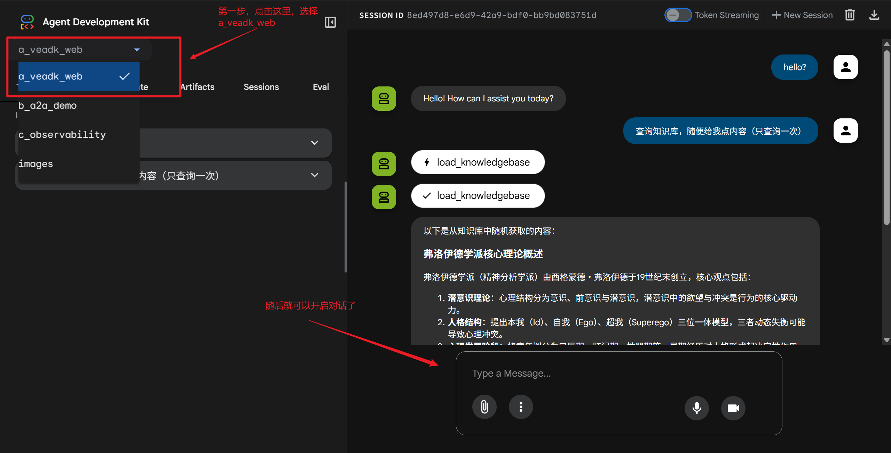

### 02. b_a2a_demo

这个demo用来简要的演示a2a服务。

- 启动服务端
```bash
cd b_advanced_usage/b_a2a_demo 

python server/server.py
```

- 启动客户端
```bash
cd b_advanced_usage/b_a2a_demo 

python client.py
```


- 关于a2a协议，更多的信息可以参考以下链接

https://github.com/a2aproject/a2a-python

https://a2a-protocol.org/latest/


- 另外启动server之后，可以通过

http://localhost:8022/.well-known/agent-card.json

来查看agent-card.json的信息


对于a2a协议，你可以大致理解为：我们肯定有需求，需要将一些agent部署到某个平台，在本地通过另一些agent调用，实现两个agent之间的沟通，那么这个沟通的协议是什么？a2a。

当然你可以使用其他的协议来完成这个事情，比如mcp协议（这里埋个伏笔，因为veadk后面也做了），但a2a是一个更推荐的选择。


### 03. c_observability

这部分演示的是agent可观测技术，通俗的来说，ai agent和传统服务一样，需要有日志来记录他的运行，记录每次输入输出，以及token消耗等信息，这就需要veadk通过埋点的方式来进行上报。

veadk通过OpenTelemetry进行上报，具体可以看[这里的源码部分](https://github.com/volcengine/veadk-python/tree/main/veadk/tracing)


可观测部分的demo分为三部分，第一个为本地模式，后两种为上报模式

- local_tracer.py: trace的本地记录
- cozeloop_tracer.py: trace信息上报到cozeloop
- apmplus_tracer.py: trace上报到apmplus


##### 03-1. local_tracer.py

local模式无需配置其他的config.yaml项目了，运行即可。
（注：0.2.7及以下版本，windows用户无法运行本代码，请直接跳过。后续版本会修改）


##### 03-2. coze_tracer.py

准备工作

首先还是配置config.yaml

```yaml
observability:
  opentelemetry:
    cozeloop:
      endpoint: https://api.coze.cn/v1/loop/opentelemetry/v1/traces
      api_key: # app_key
      service_name:  # Coze loop `space_id`
```

api_key和service_name分别先空着，根据我接下来的操作填入即可

1. **前往 [扣子罗盘](https://www.coze.cn/loop)，选择右上角登录扣子**


2. **进入扣子罗盘**

进入之后默认是Demo空间，我们要先切换到个人空间（或者你可以创建新的空间，这个随你）

随后获取两个信息，分别是

`Space Id`和`Secret token`，分别对应了config.yaml里的`service_name`和`api_key`

> - space_id -> config.yaml -> service_name
>
> - token -> config.yaml -> api_key

首先可以直接在空间url里获取你的space-id, 而app_key的获取则比较复杂，如图所示，可以从这两个地方获取这两个信息。

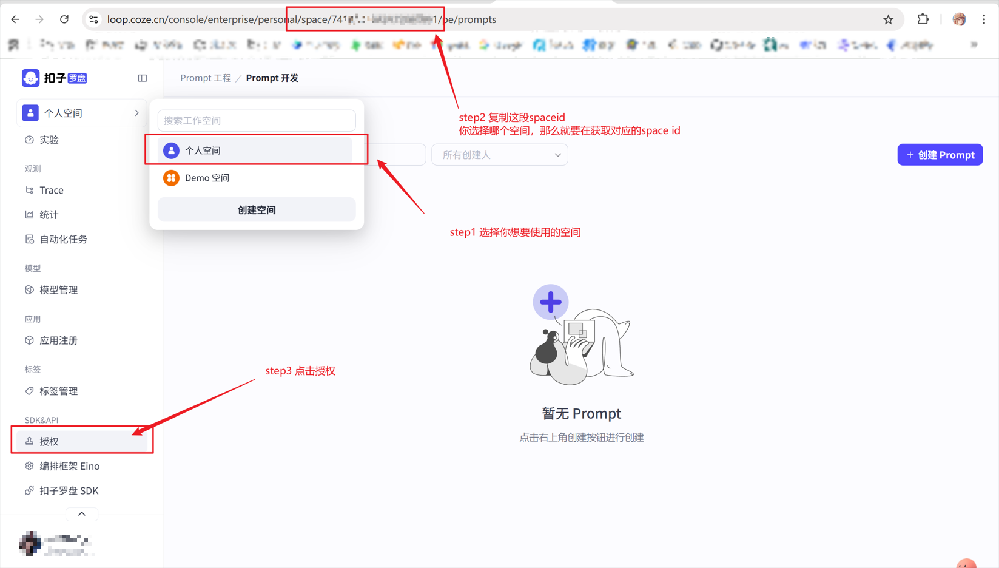

3. **获取space_id，放入config.yaml的service_name字段中**

我们首先从url里读取Space Id，将其填入config.yaml的service_name字段中，随后点击授权，创建个人访问令牌，注意，必须**至少**选择罗盘的授权，其他的你随意。

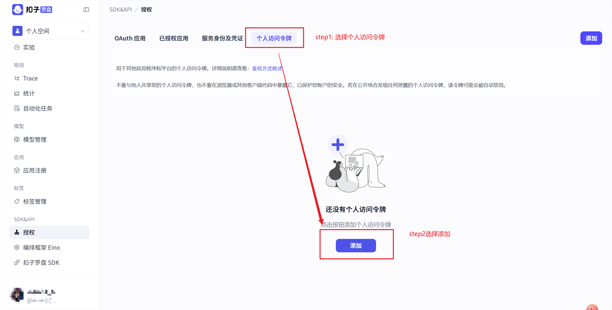

4. **获取Secret token，放入config.yaml里的api_key**

这里创建token即可，注意过期时间，如果你跑了一段时间之后发现上报不上去了，可能是过期时间到了。另外还是像刚才说的，授权里至少选罗盘，其他的看你。下面还有访问空间，访问空间选择你之前确定的那个，如果默认的话就是个人空间。


点击确定

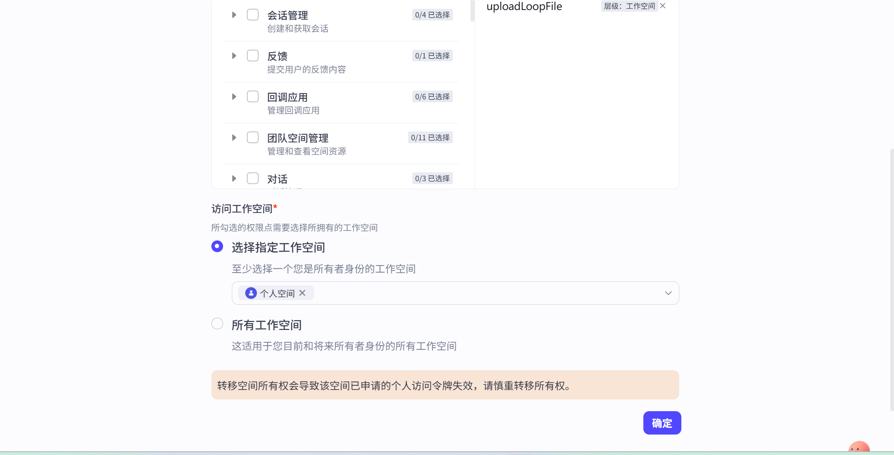


随后会出现一个提示，告诉你这个令牌仅显示一次，复制好这个token，copy到config.yaml，cozeloop的api_key位置

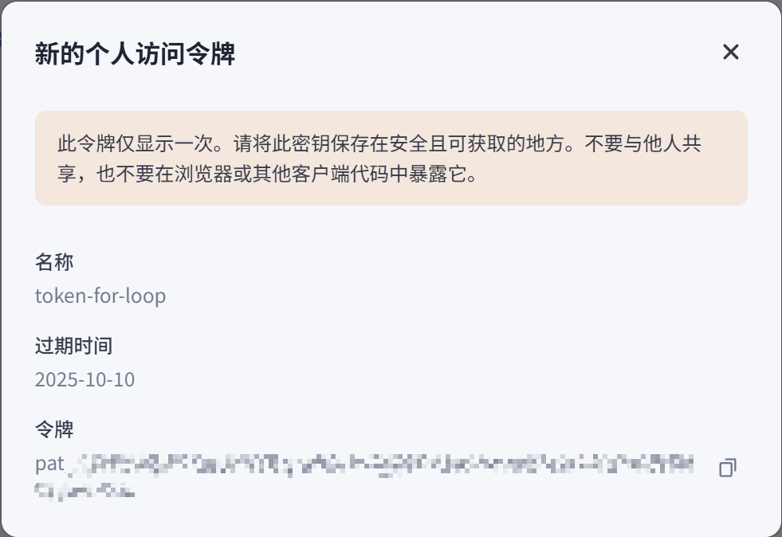


**注意：如果你使用的是本地部署的cozeloop，我没有研究过，可能endpoint也需要修改**


ok，可以继续运行脚本了

5. 运行"examples/b_advanced_usage/c_observability/cozeloop_tracer.py"

```bash
python examples/b_advanced_usage/c_observability/cozeloop_tracer.py
```

6. 去刚刚的cozeloop里看数据

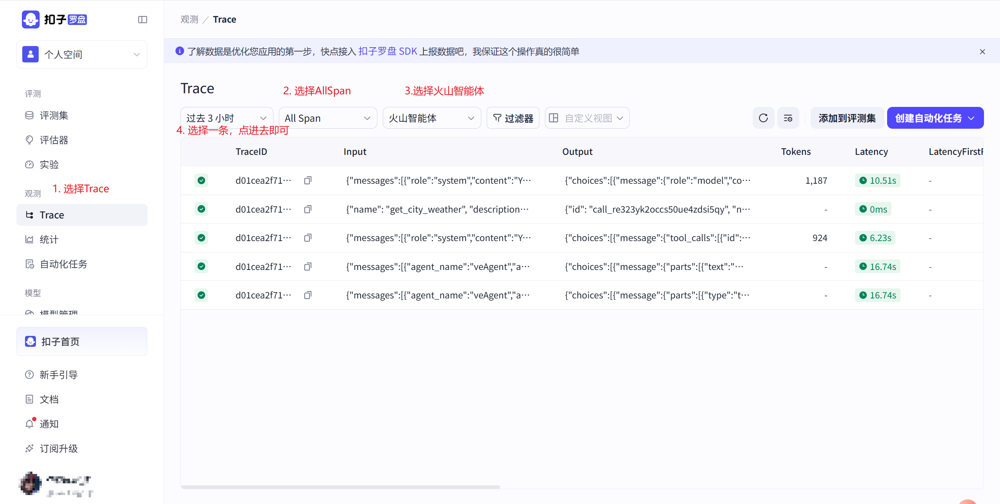


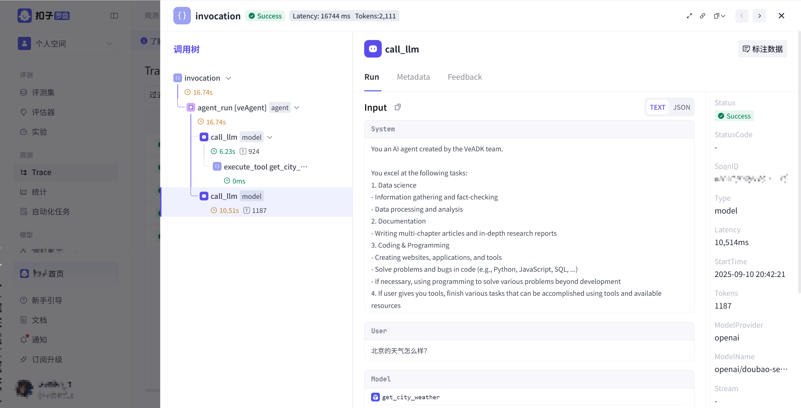

可以看到，这是一个完整的调用树，这个调用树和local中dump下来的是保持一致的

你的system-prompt还有工具调用信息啊，输入输出也以及token消耗信息都会在这里看到

这里有一点说明一下，你可以选择AllSpan也可以选择RootSpan，如果是RootSpan，那么就是只显示最外层的调用Span（也就是invocation），如果是AllSpan，那么就是显示所有的调用


### 04. d_vefaas_deploy

本脚本演示如何在vefaas上部署一个agent，方便你可以远程调用，由于我比较懒，所以直接使用veadk默认的demo吧

首先说config.yaml里要配置什么，这次的话还是只需要配置火山引擎的ak和sk。（在章节a的第四节介绍过了，我就不重复了）

其次，火山引擎开通内容


1. 在这之前，记得先充值哈


2. **进入[火山引擎函数服务](https://www.volcengine.com/product/vefaas)（vefaas)**，点击立即使用

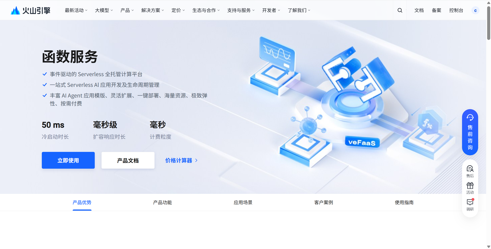

3. 授权开通

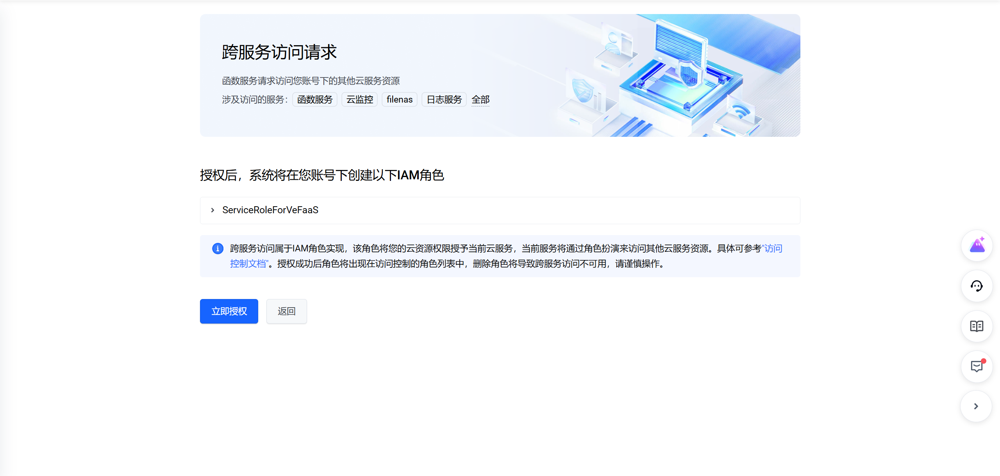


4. 进入[火山引擎API网关](https://www.volcengine.com/product/apig) ，同样点击立即使用，开通授权

因为vefaas需要公网访问，所以要创建一个API网关


这里强烈建议直接创建一个API网关实例，方便后续使用，当然没有也可以，不过我建议创建一个，这样后续速度会快很多。比如我这里就创建了一个网关实例名称为`veadk-apig`

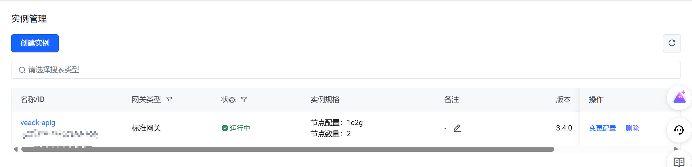

5. 为授权ServerlessApplicationRole角色

目前`veadk==0.2.7`，这一步无法自动完成，需要手动执行，后续可能会优化

首先，随便选择一个vefaas的应用模板，比如[这个](https://console.volcengine.com/vefaas/region:vefaas+cn-beijing/application/create?templateId=67f7b4678af5a6000850556c)。

然后添加这些策略，点击一键添加策略，退出即可

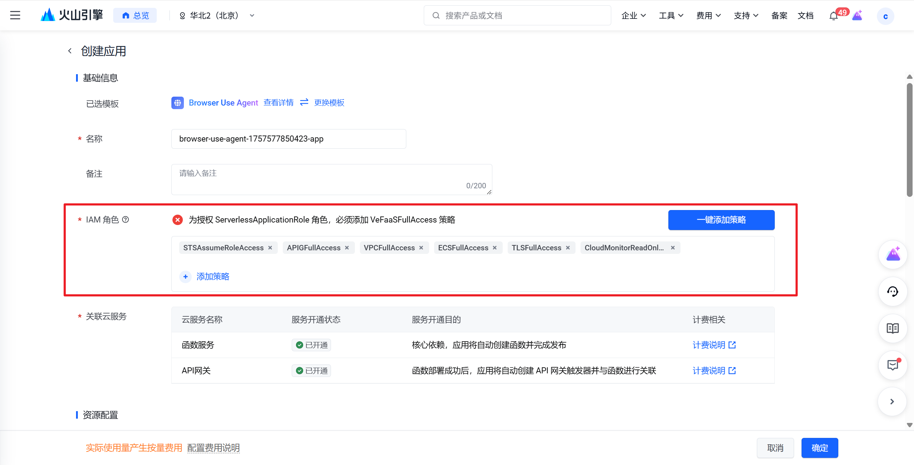


5. 开始vefaas部署流程

```bash
# 进入操作目录
cd examples/b_advanced_usage/d_vefaas_deploy

# veadk 初始化
veadk init 
# 接下来一路回车即可，(如果前面创建了apig，那么在第二次里输入apig名称）直到让你选mode1还是mode2

# 选择mode1
```

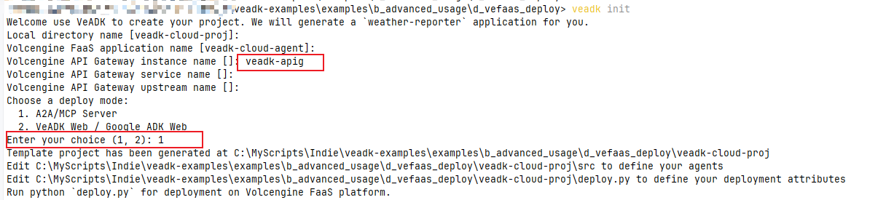


然后你会看到，这里出现了一套代码

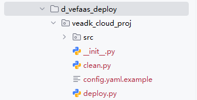


首先把你的config.yaml 直接copy到veadk_cloud_proj里，这个config.yaml至少要有

1. model agent部分
2. 火山 ak和sk部分

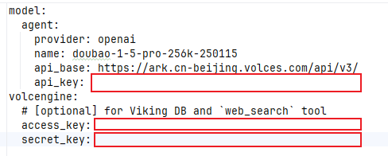

3. vefaas的配置（可选）

另外，如果你需要在Vefaas部署的agent上记录Trace，那么也要在config.yaml里记录`observability`部分（这个在03节说过了，不多说了）。其次要开启tracer。

4. vefaas 鉴权关闭

vefaas_enable_key_auth: false 关闭鉴权，方便我们演示使用。（注意，这个在0.2.7是默认开启的，请拉取最新的分支）

总之，要配置这些

```yaml
model:
  agent:
    provider: openai
    name: doubao-1-5-pro-256k-250115
    api_base: https://ark.cn-beijing.volces.com/api/v3/
    api_key: 
volcengine:
  # [optional] for Viking DB and `web_search` tool
  access_key:
  secret_key:


observability:  # （可选，开启trace用的）
    cozeloop:
      endpoint: https://api.coze.cn/v1/loop/opentelemetry/v1/traces
      api_key:
      service_name:

veadk:     # (可选，开启tracer用的)
  tracer:
    apmplus: false
    cozeloop: true
    tls: false
    
vefaas_enable_key_auth: false
```


4. requirements.txt

veadk_cloud_proj/src/requirements.txt

这个是配置依赖项的

不多说了，建议直接至少配置这些,不然可能跑不起来。

```ini
veadk-python==0.2.6
fastapi
uvicorn[standard]
```


5. 运行代码

注意1：这对于win平台用户，这里有个事情需要注意，部署之前必须要保证所有的换行符都是LF的，而不是CRLF的，不然vefaas上会出错的

```bash
# 在之前的基础上，（当前路径为d_vefaas_deploy）
cd veadk_cloud_proj
python deploy.py 
```

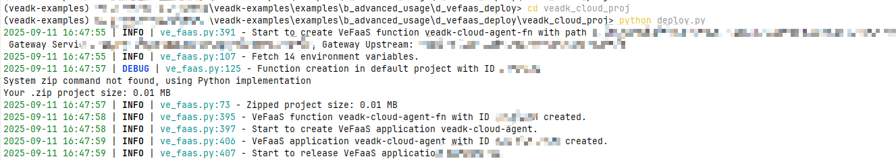


OK，整个部署流程完毕。（中间可能出现各种意外错误，如果遇到各种问题，欢迎提出issue）

如果你走完整个流程可以在这里看到一个URL，这就是你应用所在的URL。


### 05. e_evaluate

### 06. f_prompt_pilot


